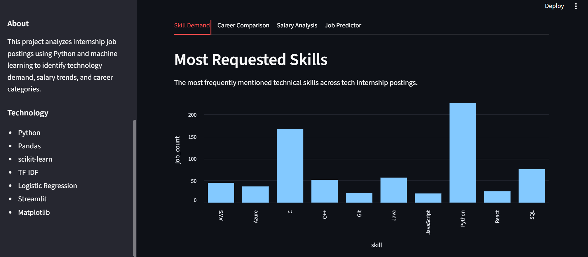
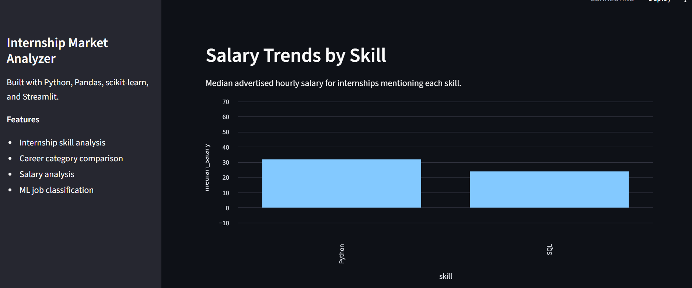
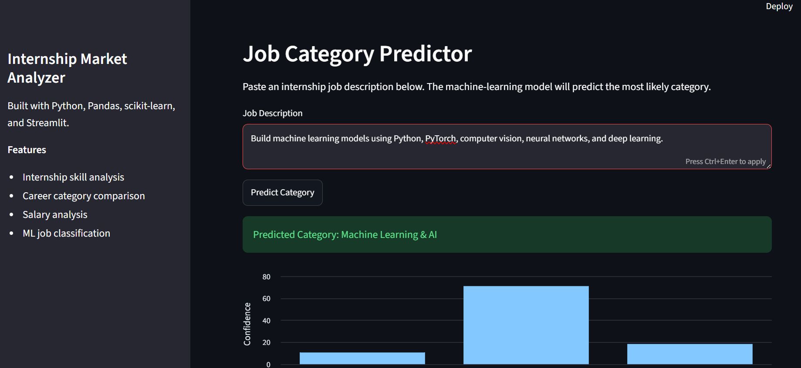

# Internship Market Analyzer

A Python data science and machine learning application that analyzes internship job postings to identify in-demand technical skills, compare salary trends, and classify internship roles.

## Dashboard Screenshots

### Skill Demand


### Career Comparison


### Salary Analysis


### Job Category Predictor


## Features

* Analyze the most frequently requested technical skills in internship postings
* Compare skill demand across Software Engineering, Data Science, and Machine Learning roles
* Analyze median hourly salary by technical skill
* Classify internship job descriptions using machine learning
* Display prediction confidence for each job category
* Explore results through an interactive Streamlit dashboard

## Tech Stack

* Python
* Pandas
* Matplotlib
* scikit-learn
* TF-IDF
* Logistic Regression
* Streamlit
* Joblib
* Git / GitHub

## Project Pipeline

```text
Job Posting Dataset
        |
        v
Data Cleaning & Filtering
        |
        v
Skill Extraction
        |
        +--------------------+
        |                    |
        v                    v
Skill Demand             Salary Analysis
        |
        v
TF-IDF Text Features
        |
        v
Logistic Regression
        |
        v
Job Category Prediction
        |
        v
Streamlit Dashboard
```

## Machine Learning

The project uses TF-IDF to convert internship job descriptions into numerical text features.

A multiclass Logistic Regression model predicts whether a posting belongs to one of three categories:

* Software Engineering
* Data Science & Analytics
* Machine Learning & AI

The dataset is split into stratified training and testing sets.

The model is evaluated using:

* Accuracy
* Precision
* Recall
* F1 score
* Confusion matrix

Current test accuracy: **75.91%**

## Skill Analysis

Technical skills are extracted from internship descriptions using text pattern matching.

Examples include:

* Python
* Java
* C++
* JavaScript
* SQL
* AWS
* Azure
* Git
* Docker
* Kubernetes
* React
* Pandas
* NumPy
* TensorFlow
* PyTorch

The application calculates both the number and percentage of postings mentioning each skill.

## Salary Analysis

For internship postings containing usable hourly salary ranges, the project calculates the salary midpoint and compares median hourly salaries across technical skills.

Only skills with a minimum sample size are included in the comparison.

Salary relationships represent associations in the dataset and should not be interpreted as causal effects.

## Interactive Dashboard

The Streamlit interface includes:

* Top requested skills
* Career-area skill comparison
* Salary analysis
* Machine-learning job classifier
* Prediction confidence visualization

## Project Structure

```text
Internship-Market-Analyzer/
|
|-- app.py
|-- requirements.txt
|-- README.md
|
|-- data/
|   |-- skill_demand.csv
|   |-- category_skill_demand.csv
|   |-- skill_salary_analysis.csv
|   `-- model_top_features.csv
|
|-- models/
|
|-- src/
|   |-- real_data_analysis.py
|   |-- category_analysis.py
|   |-- salary_analysis.py
|   |-- job_classifier.py
|   |-- model_analysis.py
|   `-- predict_job.py
|-- screenshots/ 
|   |-- skill-analysis.png 
|   |-- career-comparison.png 
|   |-- salary-analysis.png 
|   `-- predictor.png
```

## Running the Project

Create a virtual environment:

```bash
python -m venv venv
```

Activate it on Windows:

```bash
venv\Scripts\activate
```

Install dependencies:

```bash
pip install -r requirements.txt
```

Train the model:

```bash
python src/model_analysis.py
```

Run the Streamlit application:

```bash
python -m streamlit run app.py
```

## What I Learned

This project provided hands-on experience with:

* Cleaning and analyzing real-world datasets
* Pandas DataFrames and data transformations
* Exploratory data analysis
* Regular-expression based text extraction
* Data visualization
* TF-IDF text feature engineering
* Supervised machine learning
* Multiclass classification
* Model evaluation and interpretation
* Persisting trained models with Joblib
* Building interactive data applications with Streamlit
